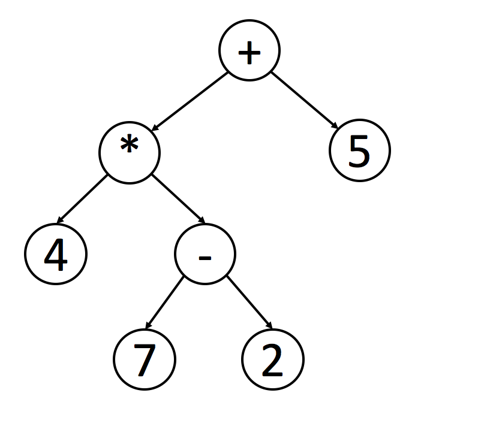

# Introduction

A **tree** is a frequently-used data structure to simulate a hierarchical tree structure.

Each node of the tree will have a root value and a list of references to other nodes which are called child nodes. From graph view, a tree can also be defined as a directed acyclic graph which has `N` nodes and `N-1 `edges.

A **Binary Tree** is one of the most typical tree structure. As the name suggests, a binary tree is a tree data structure in which each node has at most two children, which are referred to as the left child and the right child.

By completing this card, you will be able to:
- Understand the concept of a tree and a binary tree;
- Be familiar with different traversal methods;
- Use recursion to solve binary-tree-related problems;

## **Traverse a Tree**

#### Pre-order Traversal

Pre-order traversal is to visit the root first. Then traverse the left subtree. Finally, traverse the right subtree.

#### In-Order Traversal

In-order traversal is to traverse the left subtree first. Then visit the root. Finally, traverse the right subtree.

Typically, for **binary search tree**, we can retrieve all the data in sorted order using in-order traversal.

#### Post-Order Traversal

Post-order traversal is to traverse the left subtree first. Then traverse the right subtree. Finally, visit the root.

It is worth noting that when you delete nodes in a tree, deletion process will be in post-order. That is to say, when you delete a node, you will delete its left child and its right child before you delete the node itself.

Also, post-order is widely use in mathematical expression. It is easier to write a program to parse a post-order expression. Here is an example:

## **Recursive or Iterative**

Practice the three different traversal methods.
You might want to implement the methods recursively or iteratively. Implement both recursion and iteration solutions and compare the differences between them.
